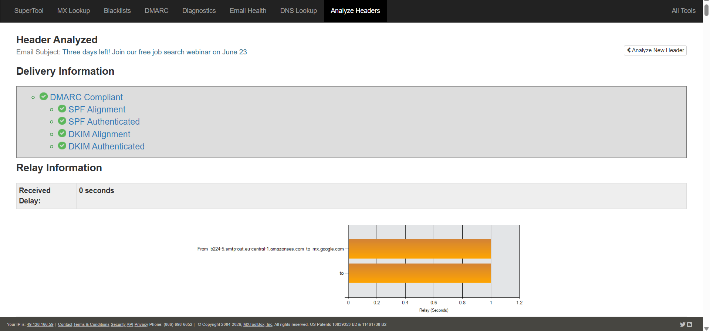
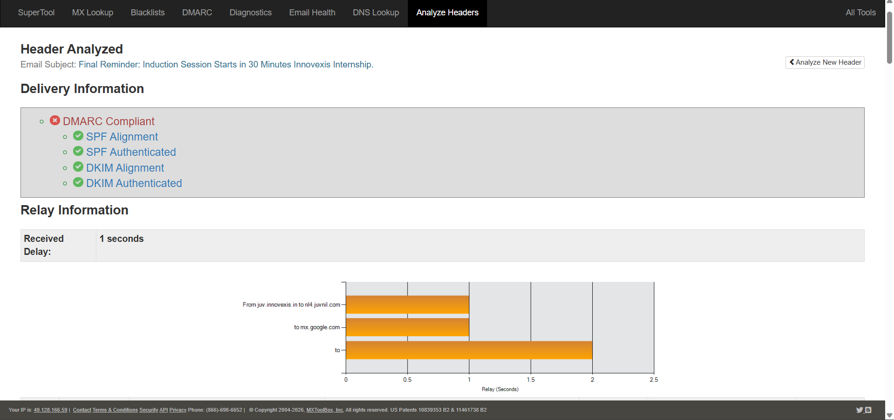
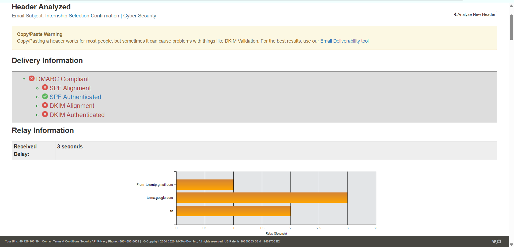
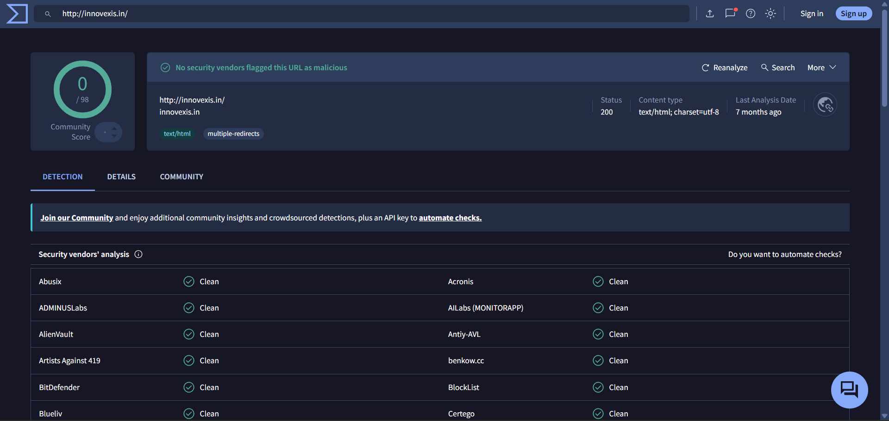
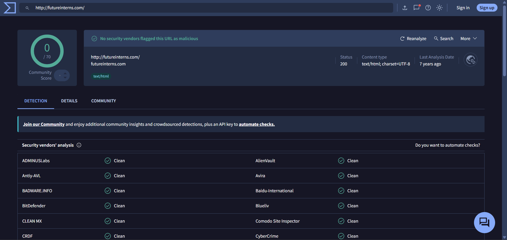

<h1 align="center">Phishing Email Analysis</h1>

SOC Investigation Case Study • Email Header Analysis • Threat Detection

---

## 📌 Overview
This project documents a hands-on phishing email analysis performed as part of SOC analyst skill-building. Three real emails were analyzed using MXToolbox and VirusTotal to identify legitimate vs phishing/scam emails based on email authentication headers and domain reputation.

---

## 🎯 Objectives
- Analyze email headers using MXToolbox
- Check SPF, DKIM, and DMARC authentication results
- Verify domain reputation using VirusTotal
- Identify phishing red flags and social engineering tactics
- Distinguish legitimate emails from phishing/scam emails

---

## 🛠️ Tools Used
| Tool | Purpose |
|------|---------|
| MXToolbox | Email header analysis — SPF, DKIM, DMARC check |
| VirusTotal | Domain and URL reputation check |
| Gmail | Source emails for analysis |

---

## 📧 Emails Analyzed

### 1. LoopCV (updates@loopcv.com)
- **Type:** Job platform update email
- **Verdict: ✅ Legitimate**

### 2. Innovexis (support@innovexis.in)
- **Type:** Internship offer email
- **Verdict: ❌ Scam**

### 3. Future Interns (contact@futureinterns.com)
- **Type:** Internship selection email
- **Verdict: ❌ Phishing**

---

## 🔍 SPF / DKIM / DMARC Analysis

| Email | SPF | DKIM | DMARC | Verdict |
|-------|-----|------|-------|---------|
| LoopCV (updates@loopcv.com) | ✅ Pass | ✅ Pass | ✅ Pass | Legitimate |
| Innovexis (support@innovexis.in) | ✅ Pass | ✅ Pass | ✅ Pass | Scam ❌ |
| Future Interns (contact@futureinterns.com) | ✅ Pass | ❌ Fail | ❌ Fail | Phishing ❌ |

---

## 🚩 Red Flags Identified

### Future Interns (contact@futureinterns.com)
- DKIM and DMARC both failed
- Generic domain name — futureinterns.com
- Urgency tactic used — "30 minutes left!"
- Selection confirmation received without ever applying
- No verifiable company presence

### Innovexis (support@innovexis.in)
- SPF/DKIM/DMARC all pass — but domain itself is suspicious
- Used Juvlon bulk email tool — legitimate companies avoid this
- Vague stipend language
- No verifiable office address or LinkedIn presence
- Mass email pattern detected

---

## 🧠 Key Learnings

| Concept | Explanation |
|---------|-------------|
| SPF | Verifies sending IP is authorized for the domain |
| DKIM | Digital signature — proves email was not tampered |
| DMARC | Policy that requires SPF + DKIM both to pass |
| SPF/DKIM/DMARC Pass | Does NOT guarantee email is safe — domain itself can be fake |
| VirusTotal Clean | Does NOT mean 100% safe — new domains are not flagged immediately |

---

## ⚠️ Important Insight
SPF, DKIM, and DMARC passing does not mean an email is safe. A threat actor can register a legitimate-looking domain, configure all authentication correctly, and still send phishing or scam emails. Always cross-check domain age, company presence on LinkedIn, and context (did you actually apply?).

---

## 📸 Screenshots

### MXToolbox Analysis

### VirusTotal Results

---

## 🔐 Security Insight
Phishing detection is not just about technical checks — it requires combining header analysis, domain reputation, context awareness, and social engineering recognition. A SOC analyst must look beyond authentication results and evaluate the full picture.

---

## 🧠 Conclusion
This project demonstrates practical phishing email analysis skills used daily by SOC Tier 1 analysts. By combining MXToolbox header analysis with VirusTotal domain reputation checks and contextual red flag identification, accurate verdicts were reached on all three emails.

---

## 📁 Project Files
- screenshots/ → MXToolbox and VirusTotal analysis screenshots
- README.md → Full investigation documentation
